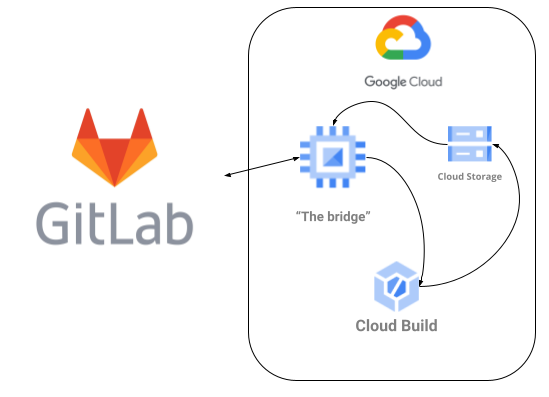

# Cloud Build Gitlab Runner Bridge

This repo hosts the config and scripts required to run your set up [Google Cloud Build](https://cloud.google.com/build/docs/overview) as the backend for your GitLab CI.

With Cloud Build you get a performant and scalable fleet of executors for your builds and only [pay for what you
use](https://cloud.google.com/build/pricing).

Below is the architecture of this setup:



The main component is a virtual machine, the bridge, which runs [a Custom executor](https://docs.gitlab.com/runner/executors/custom.html) that runs your builds in Cloud Build rather than locally.

## Quick Start

1. Build the Docker image that contains the config and scripts for the bridge.

    ```shell
    export PROJECT=$(gcloud config get-value project)
    gcloud builds submit -t gcr.io/$PROJECT/gitlab-runner-cloudbuild .
    ```

1. Obtain your runner registration token by following docs:

    https://docs.gitlab.com/runner/register/#requirements

    For gitlab.com, you must configure a [project-specific runner](https://docs.gitlab.com/ee/ci/runners/README.html#specific-runners).

1. Run the gitlab-runner to [register your runner](https://docs.gitlab.com/runner/register/).

    ```shell
    mkdir etc
    export REGISTRATION_TOKEN=<SET_YOUR_TOKEN_HERE>
    export GITLAB_URL=https://gitlab.com
    docker run --rm -it -v `pwd`/etc:/etc/gitlab-runner gitlab/gitlab-runner register -n -r ${REGISTRATION_TOKEN} -u ${GITLAB_URL} --tag-list cloudbuild --executor custom
    ```

1. Setup IAM for the bridge VM

    ```shell
    gcloud iam service-accounts create gitlab-runner
    gcloud projects add-iam-policy-binding ${PROJECT} --member=serviceAccount:gitlab-runner@${PROJECT}.iam.gserviceaccount.com --role='roles/editor'
    ```

1. Get the token from the config file that was generated in ./etc/config.toml:

    ```shell
    cat ./etc/config.toml | grep token
    ```

1. Create a secret in Secrets Manager with your token in it:

    ```shell
    gcloud secrets create gitlab-runner-token
    echo "$TOKEN" | gcloud secrets versions add gitlab-runner-token --data-file=-
    gcloud secrets add-iam-policy-binding gitlab-runner-token --member=serviceAccount:gitlab-runner@${PROJECT}.iam.gserviceaccount.com --role='roles/secretmanager.secretAccessor'
    ```

1. Create a Cloud Storage bucket for passing artifacts between Cloud Build and the bridge VM.

    ```shell
    gsutil mb gs://$PROJECT-gitlab-cache
    ```

1. Run the gitlab-runner container in a VM:

    ```shell
    gcloud compute instances create-with-container gitlab-runner-cloudbuild-$(date +%s) \
                    --machine-type=e2-standard-2 \
                    --service-account=gitlab-runner@${PROJECT}.iam.gserviceaccount.com \
                    --scopes=https://www.googleapis.com/auth/cloud-platform \
                    --image-family=cos-stable --image-project=cos-cloud \
                    --container-image=gcr.io/$PROJECT/gitlab-runner-cloudbuild \
                    --container-restart-policy=always \
                    --boot-disk-size=200GB
    ```

1. Ensure your `.gitlab-ci.yml` sets the builds tag to `cloudbuild`. For example:

    ```yaml
    build:
      tags:
      - cloudbuild
      stage: build
      script:
      - echo "This will run in Cloud Build"
    ```
